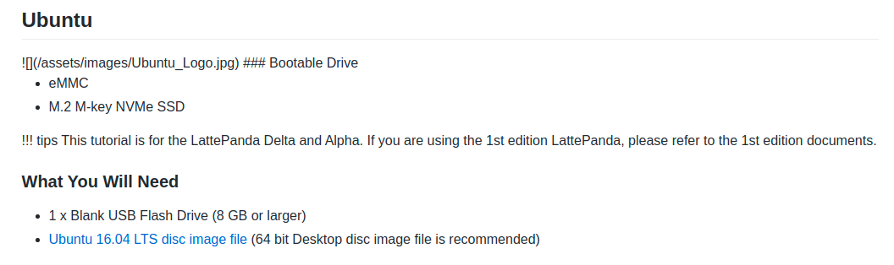

# Latte Panda

## Key resources

https://github.com/LattePandaTeam/Docs
https://www.lattepanda.com/

The git hub seems to have more data than the website, so I prefer looking at the github

## Latte Panda Delta

It seems like this version of the lattepanda can use the normal/official version of ubuntu, atleast fopr 16.04

